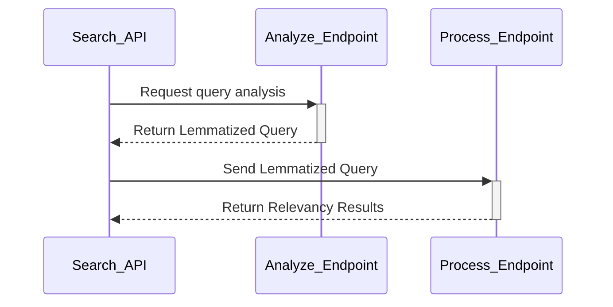
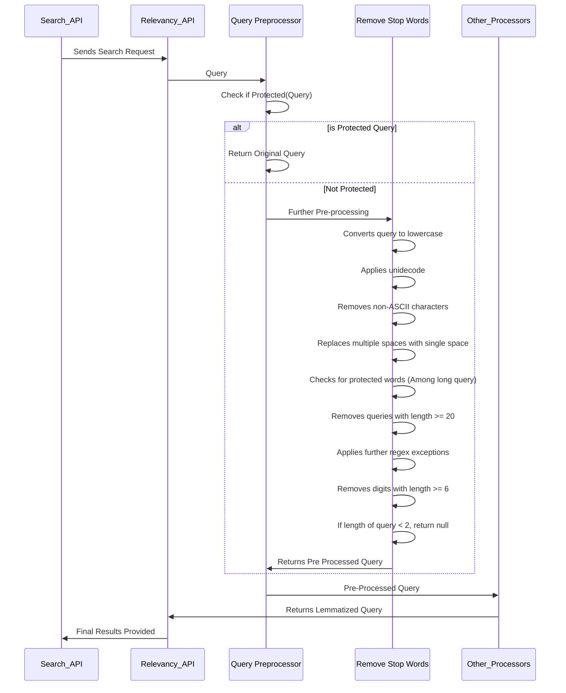

# Query Ranking API


Query Ranking API is a RESTful web service developed using the FastAPI framework.
It employs multiple search ranking models to effectively rank products based on various features.

---

<details>
<summary>Exposed Endpoints</summary>

| Name      | URL                                                                                              | Analyze                                                                                                        | Rank                                                                                                     |
| --------- | ------------------------------------------------------------------------------------------------ | -------------------------------------------------------------------------------------------------------------- | -------------------------------------------------------------------------------------------------------- |
| Falabella | [https://search-prod.falabella.services/ranker/](https://search-prod.falabella.services/ranker/) | [https://search-prod.falabella.services/ranker/analyze](https://search-prod.falabella.services/ranker/analyze) | [https://search-prod.falabella.services/ranker/rank](https://search-prod.falabella.services/ranker/rank) |
| Fazil     | [https://www.fazil.services/ranker/](https://www.fazil.services/ranker/)                         | [https://www.fazil.services/ranker/analyze](https://www.fazil.services/ranker/analyze)                         | [https://www.fazil.services/ranker/rank](https://www.fazil.services/ranker/rank)                         |

Refer to the Curl Command Examples Section below for generating the curl command

</details>

---

<details>
<summary>Getting Started and Configurational Updates</summary>

## Getting Started

### Basic Setup Steps

1. **Clone the Repository**
   - Use the command `git clone <repository>` to clone the repository to your local machine.

1. **Install Dependencies**
   - Run `pip install -r requirements.txt` to install all required Python dependencies.

1. **Configure API Settings**
   - Adjust the Learning to Rank configurations and database connections
     in `src/resources/config/core-search-local-config.json` .

1. **Run the API Server**
   - Launch the server with `uvicorn main:app --host 0.0.0.0 --port 5000 --reload`.
   - For Pycharm Select `Module` = uvicorn & `Script Parameters` = main:app --host 0.0.0.0 --port 5000 --reload

1. **Pre-commit Hook**
   - **Overview**: Our repository leverages the [pre-commit](https://pre-commit.com/) framework to manage and maintain
     pre-commit hooks. These hooks help automate the process of identifying and solving simple issues before submission
     to code review. Pre-commit hooks run on every commit to automatically point out issues like code formatting,
     linting errors, and testing failures.

   - **Setup**:
     - Ensure you have pre-commit installed. If not, install it using `pip install pre-commit` or refer to
       the [official documentation](https://pre-commit.com/#install) for detailed instructions.
     - Install the pre-commit hook scripts into your `.git/` directory. This can be done by
       running `pre-commit install` within the repository.

   - **Included Hooks**:
     - **Code Formatting**: We use `black` to enforce a uniform code format across our project.
     - **Import Sorting**: The `isort` hook reorders imports in a consistent way, set to be compatible with `black`.
     - **JSON Pretty-Format**: Ensures all JSON files are correctly formatted with a four-space indent and UTF-8
       encoding.
     - **Python Linting**: `pylint` is configured to catch errors and enforce a coding standard.
     - **Python Testing**: A local `pytest` hook is set up to run tests located in the `tests/` directory, ensuring
       that changes do not break existing functionality.

   - **Running Pre-commit**:
     - Execute the command `make pre-commit` which is configured to run the pre-commit checks. This command should be
       run after making changes and before committing to the repository to identify and solve common issues.
     - In case you make further changes after running pre-commit, it is advisable to run `make pre-commit` again to
       ensure all hooks pass.

   - **Continuous Integration**: Our GitLab CI/CD pipeline is configured to run a similar set of checks,
     including `pytest` with coverage reports.

   - **Note**: Pre-commit hooks are a preventative measure to reduce the likelihood of CI pipeline failures.

By following these steps and utilizing pre-commit hooks, we aim to maintain high-quality and consistent code standards
within our project.

### IDE Configuration

For an optimized development experience, make the following configurations in your Python editor:

```shell
# Set default environment variables
PYTHONUNBUFFERED=1;
GCP_PROJECT_ID=core-search-local
```

- The `core-search-local` environment is tailored for local development.
- It allows you to work seamlessly with environment specifications, facilitating an easier development process.

### MongoDB Connection for Development

> **Note for core-search-dev Environment:**
> This environment operates on a single node and does not use a replica set. Therefore, remember to comment out the
> replica set configuration in your MongoDB connection settings.

1. **Port Forwarding Tool**
   - We recommend using [Kube Forwarder](https://kube-forwarder.pixelpoint.io/) for connecting to MongoDB via port
     forwarding.

1. **Environment Selection**
   - Preferably connect to the `core-search-dev` MongoDB for development purposes. This helps to avoid any unintended
     alterations in production environments and is ideal for testing.

</details>

---

<details>
<summary>Technical Overview of Query Ranking - Endpoints </summary>

## Query Ranking API - Detailed Overview

The Query Ranking API is an advanced, asynchronous API that specializes in processing and ranking search queries. It
supports two primary functionalities: Lemmatization and Ranking, accessible through its key endpoints `/analyze`
and `/process`.

### Key Endpoints and Their Operations

1. **/analyze - Lemmatization Endpoint**
   - **Pre-processing:** The initial stage involves the Query Preprocessor, which prepares the query by applying
     various pre-processing techniques.
   - **Custom Lemmatizer:** Post-preprocessing, the query undergoes lemmatization, transforming it into its root form.
     This step enhances the effectiveness of string matching, crucial for accurate search results.

1. **/process - Ranking Endpoint**
   - **Ranker Operation:** At this stage, the API engages the Ranker, which leverages Learning to Rank (LTR) models.
     These models are tenant-specific and provide a preliminary set of ranked results.
   - **Classifier and NER Processing:** Following the Ranker, the Classifier comes into play, contributing additional
     layers of analysis. Notably, the Named Entity Recognition (NER) operates as a subprocessor within the Classifier.
     This subprocessor enriches the query's context, further refining the search results.

The Query Ranking API's asynchronous nature ensures efficient processing of search queries, delivering prompt and
relevant search results. Each endpoint and subprocessor within the API plays a pivotal role in optimizing the search
experience, making it a robust tool for any search-driven application.

</details>

---

<details>
<summary>Curl Command Examples for hitting the endpoints </summary>

For interacting with the API endpoints, tools like Postman or Insomnia are suitable. While there's no specific
recommendation between the two, here are some sample curl commands that can kickstart your journey with the API
endpoints in a development environment.

### '/doc' Endpoint Overview

The '/doc' endpoint is a standard feature in FastAPI, providing a comprehensive view of all the available endpoints in
the API. It employs the Swagger UI for easy visualization and interaction.

### '/live' Endpoint Functionality

The '/live' endpoint serves a fundamental purpose in API management. It confirms the operational status of the API,
ensuring that it is functioning correctly. The 'live' designation indicates that this endpoint is a reliable indicator
of the API's current state.

### `/analyze` Endpoint

Use this endpoint for retrieving the lemmatized form of a provided query.

```shell
curl --request POST \
  --url http://localhost:5000/analyze \
  --header 'Authorization: auth-value' \
  --header 'Content-Type: application/json' \
  --header 'tenant: 5f66269c-6d96-48fb-abe0-e91ae769c54c' \
  --data '{"enableDynamicFacets": false,"query": "corriendo"}'
```

#### `/rank` Endpoint

This endpoint returns the results of both the Ranker and Classifier for a given query.

#### Curl Command for SLP Request

- The key "query" in data/body is the relevancy SLP query

```shell
curl --request POST \
  --url http://localhost:5000/rank \
  --header 'Authorization: auth-value' \
  --header 'Content-Type: application/json' \
  --header 'tenant: f6adf6a4-7d13-4485-87dd-f78d5997543c' \
  --data '{"query": "abrigo amarillo","enableDynamicFacets": false}'
```

#### Curl Command for PLP Request

- The plp query is `cat123`, and can be accessed via body["filters"]["product.parentCategoryPaths.search"]
- Note, only the first element of the list will be taken, and it will be converted to lowercase before processing

```shell
curl --request POST \
  --url http://localhost:5000/rank \
  --header 'Authorization: auth-value' \
  --header 'Content-Type: application/json' \
  --header 'tenant: f6adf6a4-7d13-4485-87dd-f78d5997543c' \
  --data '{"enableDynamicFacets": true,
  "filters":{"product.parentCategoryPaths.search": ["cat123"]}}'
```

#### Curl Command for Generic LTR Request

- The slp query is `colo colo`

```shell
curl --request POST \
  --url http://localhost:5001/rank \
  --header 'Authorization: auth-value' \
  --header 'Content-Type: application/json' \
  --header 'ab-flags: clf' \
  --header 'tenant: f6adf6a4-7d13-4485-87dd-f78d5997543c' \
  --data '{
    "context": "colo colo"
}
```

</details>

---

<details>
<summary>Architecture - Query Ranking & Relevancy API Comparison</summary>

### New Architecture: Query Ranking API

The following sequence diagram illustrates the interaction flow within the Query Ranking API:



In this architecture:

1. **Analyze Endpoint (/analyze):**
   - The `Search_API` sends a query to the `/analyze` endpoint.
   - The `/analyze` endpoint performs the task of lemmatization, converting the query into its root form to enhance the
     matching process.
   - Once processed, the lemmatized query is returned to the `Search_API`.

1. **Process Endpoint (/process):**
   - The `Search_API` then forwards this lemmatized query to the `/process` endpoint.
   - The `/process` endpoint is responsible for applying various ranking models, including Learning to Rank (LTR) and
     Classifier models, to determine the relevancy of the results.
   - Finally, the `/process` endpoint returns these relevancy results back to the `Search_API`.

This setup allows for flexible utilization of the lemmatized query, which can be beneficial for other processing steps
or features within the API's ecosystem. The `/process` endpoint serves as the core component for deriving the final
relevancy-based output.

### Old Relevancy API Architecture

The previous version of the relevancy API was developed using Flask and utilized concurrent processing.



</details>

---

<details>
<summary>Insomnia JSON</summary>

To facilitate API testing, you can download and import the Insomnia JSON from the following link:

[Download Insomnia JSON](./tests/Insomnia/Insomnia_Template.json)

1. **Download the JSON file**.
2. **Open Insomnia**.
3. **Go to Application menu -> Preferences -> Data -> Import Data -> From File**.
4. **Select the downloaded JSON file to import the requests**.

This will import all the predefined requests into Insomnia, allowing you to quickly test the API endpoints.

</details>
